# El-Psy-Quant Roadmap

## Purpose

This roadmap turns the sprint-by-sprint project plan into a clearer milestone timeline.

It is a rolling plan, not a contract. The order should change if the project learns something important, but the guiding principle stays the same:

```text
Build a reproducible research platform before chasing strategy complexity.
```

For the longer-term CTO platform plan beyond the current milestone, see:

```text
docs/strategy/future-platform-roadmap.md
```

## Timeline Overview

```mermaid
flowchart LR
    M1["Milestone 1<br/>Research Pipeline Foundation<br/>Sprints 1-7 ✅"] --> M2["Milestone 2<br/>Performance & Local Data Foundation<br/>Sprints 8-12 ✅"]
    M2 --> M3["Milestone 3<br/>Data Reproducibility & Research Workflow<br/>Sprints 13-16 ✅"]
    M3 --> M4["Milestone 4<br/>Research Experimentation Foundation<br/>Sprints 17-20 ✅"]
    M4 --> M5["Milestone 5<br/>Strategy Realism Foundation<br/>Sprints 21-24 ✅"]
    M5 --> M6["Milestone 6<br/>Risk & Benchmark Foundation<br/>Sprints 25-28 ✅"]
    M6 --> M7["Milestone 7<br/>Multi-Asset Research Foundation<br/>Sprints 29-32 ✅"]
    M7 --> M8["Milestone 8<br/>Research Operations Foundation<br/>Sprints 33-36 ✅"]
    M8 --> M9["Milestone 9<br/>Project Quality Foundation<br/>Sprints 37-41"]
```



## Milestone Table

| Milestone | Sprint Range | Status | Theme | Exit Criteria |
|---|---:|---|---|---|
| Milestone 1 — Research Pipeline Foundation | Sprints 1-7 | Complete | Build the first minimal moving-average crossover research pipeline. | Close prices can produce signals, positions, returns, and an equity curve. |
| Milestone 2 — Performance & Local Data Foundation | Sprints 8-12 | Complete | Add evaluation metrics and deterministic local CSV input. | The project can summarize backtests and run research from local CSV data. |
| Milestone 3 — Data Reproducibility & Research Workflow | Sprints 13-16 | Complete | Add local cache, Yahoo-to-cache workflow, and CSV-to-pipeline helper. | Live data can be persisted locally, and local CSV research can run through one helper. |
| Milestone 4 — Research Experimentation Foundation | Sprints 17-20 | Complete | Make experiments repeatable and comparable. | Multiple parameter runs can be executed and summarized without claiming false alpha. |
| Milestone 5 — Strategy Realism Foundation | Sprints 21-24 | Complete | Add realistic frictions and trade-level visibility. | Backtests include basic costs/slippage and expose trade records. |
| Milestone 6 — Risk & Benchmark Foundation | Sprints 25-28 | Complete | Improve evaluation discipline. | Results can be compared against benchmarks and basic risk-adjusted metrics. |
| Milestone 7 — Multi-Asset Research Foundation | Sprints 29-32 | Complete | Move from single-symbol to multi-symbol research. | The platform can load, run, and summarize independent multi-symbol research workflows. |
| Milestone 8 — Research Operations Foundation | Sprints 33-36 | Complete | Make repeated research workflows easier to run and inspect. | Experiments can be configured, executed, and stored more consistently. |
| Milestone 9 — Project Quality Foundation | Sprints 37-41 | Planned | Add automated quality gates and repository hygiene. | Pull requests can be checked consistently without relying only on local claims. |

## Detailed Sprint Timeline

### Completed Milestones

Detailed histories for completed milestones live in:

```text
docs/milestones/milestone-001-research-pipeline-foundation.md
docs/milestones/milestone-002-performance-and-local-data.md
docs/milestones/milestone-003-data-reproducibility-and-research-workflow.md
docs/milestones/milestone-004-research-experimentation-foundation.md
docs/milestones/milestone-005-strategy-realism-foundation.md
docs/milestones/milestone-006-risk-and-benchmark-foundation.md
docs/milestones/milestone-007-multi-asset-research-foundation.md
docs/milestones/milestone-008-research-operations-foundation.md
```

| Sprint | Milestone | Status | Main Deliverable |
|---:|---|---|---|
| S1-S7 | Milestone 1 | Complete | Market data provider, indicators, signals, positions, strategy returns, equity curve, and minimal MA crossover pipeline. |
| S8 | Milestone 2 | Complete | `total_return` and `max_drawdown`. |
| S9 | Milestone 2 | Complete | `backtest_summary`. |
| S10 | Milestone 2 | Complete | Deterministic in-memory research example. |
| S11 | Milestone 2 | Complete | `load_daily_prices_csv`. |
| S12 | Milestone 2 | Complete | CSV research example with bundled sample data. |
| S13 | Milestone 3 | Complete | Local CSV cache helpers. |
| S14 | Milestone 3 | Complete | `download_daily_prices_to_cache`. |
| S15 | Milestone 3 | Complete | `moving_average_crossover_from_csv`. |
| S16 | Milestone 3 | Complete | Milestone 3 documentation refresh. |
| S17 | Milestone 4 | Complete | Clearer download failure handling. |
| S18 | Milestone 4 | Complete | `moving_average_crossover_parameter_sweep`. |
| S19 | Milestone 4 | Complete | `summarize_parameter_sweep_results`. |
| S20 | Milestone 4 | Complete | Milestone 4 documentation refresh. |
| S21 | Milestone 5 | Complete | `transaction_cost` and cost-adjusted net returns. |
| S22 | Milestone 5 | Complete | `slippage_cost` and slippage-adjusted net returns. |
| S23 | Milestone 5 | Complete | `long_only_trade_records` and crossover trade record extraction. |
| S24 | Milestone 5 | Complete | Milestone 5 documentation refresh. |
| S25 | Milestone 6 | Complete | `cagr` and `annualized_volatility`. |
| S26 | Milestone 6 | Complete | `sharpe_ratio`. |
| S27 | Milestone 6 | Complete | `compare_to_buy_and_hold_benchmark`. |
| S28 | Milestone 6 | Complete | Milestone 6 documentation refresh. |
| S29 | Milestone 7 | Complete | `load_daily_prices_csvs` and `read_daily_prices_caches`. |
| S30 | Milestone 7 | Complete | `moving_average_crossover_multi_symbol`. |
| S31 | Milestone 7 | Complete | `summarize_multi_symbol_results`. |
| S32 | Milestone 7 | Complete | Milestone 7 documentation refresh. |

### Completed Milestone 8 — Research Operations Foundation

| Sprint | Status | Goal | Main Deliverable | Guardrail |
|---:|---|---|---|---|
| S33 | Complete | Add simple experiment config. | YAML config for local experiments. | No complex config framework. |
| S34 | Complete | Add local experiment output layout. | Deterministic folder structure for experiment results. | No database yet. |
| S35 | Complete | Add a minimal CLI wrapper. | Small command to run a local configured experiment. | CLI wraps existing functions; it must not become the core. |
| S36 | Complete | Close milestone. | Milestone 8 documentation refresh. | Keep workflows boring and repeatable. |

### Planned Milestone 9 — Project Quality Foundation

| Sprint | Status | Goal | Main Deliverable | Guardrail |
|---:|---|---|---|---|
| S37 | Complete | Plan the next platform foundation milestone. | Milestone 9 scope and sprint sequence. | Choose quality before more surface area. |
| S38 | Planned | Add GitHub Actions CI. | Automated pytest, ruff, import, and CLI help checks on PRs. | No deployment or release automation. |
| S39 | Planned | Add repository hygiene guardrails. | Line-ending normalization and PR review hygiene. | No style bikeshedding. |
| S40 | Planned | Add a local quality check entrypoint. | One local command that mirrors CI checks. | No heavy task-runner framework. |
| S41 | Planned | Close milestone. | Milestone 9 documentation refresh. | Keep quality gates simple and maintainable. |

## Future Platform Direction

The long-term CTO roadmap is documented in:

```text
docs/strategy/future-platform-roadmap.md
```

The recommended sequence after Milestone 9 is:

```text
Milestone 10 — Experiment Artifact & Comparison Foundation
Milestone 11 — Strategy Interface Foundation
Milestone 12 — Data Integrity & Universe Foundation
Milestone 13 — Portfolio Construction Foundation
Milestone 14 — Portfolio Risk & Attribution Foundation
Milestone 15 — Backtest Execution Realism Foundation
Milestone 16 — Paper Trading Foundation
```

The guiding idea is to build a research system that is hard to fool before adding live trading or strategy complexity.

## Roadmap Principles

1. Local reproducibility beats live convenience.
2. Evaluation discipline comes before strategy complexity.
3. Parameter search is not alpha discovery.
4. Costs, slippage, and benchmarks should arrive before serious strategy claims.
5. Multi-asset research should come after single-asset workflow is stable.
6. CLI and operations should wrap stable functions, not drive architecture.
7. Automated quality gates should verify claims before humans review deeper logic.
8. Every milestone should leave the repository easier to understand than before.

## Current Next Step

The next sprint is:

```text
Sprint 38 — GitHub Actions CI Foundation
```

Reason:

Milestone 8 added a usable local research operations loop. Sprint 38 should add
GitHub-hosted quality checks so future PR reviews do not rely only on local test
claims from Codex or a human contributor.
