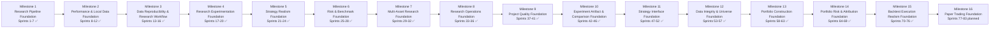

# El-Psy-Quant Roadmap

## Purpose

This roadmap turns the sprint-by-sprint project plan into a clear milestone timeline.

It is a rolling plan, not a contract. The order can change if the project learns something important, but the guiding principle stays the same:

```text
Build a reproducible research platform before chasing strategy complexity.
```

For the longer-term CTO platform plan beyond the current milestone, see:

```text
docs/strategy/future-platform-roadmap.md
```

## Timeline Overview


```mermaid
flowchart LR
    M1["Milestone 1<br/>Research Pipeline Foundation<br/>Sprints 1-7 ✅"] --> M2["Milestone 2<br/>Performance & Local Data Foundation<br/>Sprints 8-12 ✅"]
    M2 --> M3["Milestone 3<br/>Data Reproducibility & Research Workflow<br/>Sprints 13-16 ✅"]
    M3 --> M4["Milestone 4<br/>Research Experimentation Foundation<br/>Sprints 17-20 ✅"]
    M4 --> M5["Milestone 5<br/>Strategy Realism Foundation<br/>Sprints 21-24 ✅"]
    M5 --> M6["Milestone 6<br/>Risk & Benchmark Foundation<br/>Sprints 25-28 ✅"]
    M6 --> M7["Milestone 7<br/>Multi-Asset Research Foundation<br/>Sprints 29-32 ✅"]
    M7 --> M8["Milestone 8<br/>Research Operations Foundation<br/>Sprints 33-36 ✅"]
    M8 --> M9["Milestone 9<br/>Project Quality Foundation<br/>Sprints 37-41 ✅"]
    M9 --> M10["Milestone 10<br/>Experiment Artifact & Comparison Foundation<br/>Sprints 42-46 ✅"]
    M10 --> M11["Milestone 11<br/>Strategy Interface Foundation<br/>Sprints 47-52 ✅"]
    M11 --> M12["Milestone 12<br/>Data Integrity & Universe Foundation<br/>Sprints 53-57 ✅"]
    M12 --> M13["Milestone 13<br/>Portfolio Construction Foundation<br/>Sprints 58-63 ✅"]
    M13 --> M14["Milestone 14<br/>Portfolio Risk & Attribution Foundation<br/>Sprints 64-69 ✅"]
    M14 --> M15["Milestone 15<br/>Backtest Execution Realism Foundation<br/>Sprints 70-76 ✅"]
    M15 --> M16["Milestone 16<br/>Paper Trading Foundation<br/>Sprints 77-83 planned"]
```

## Milestone Table

| Milestone | Sprint Range | Status | Theme | Exit Criteria |
|---|---:|---|---|---|
| Milestone 1 — Research Pipeline Foundation | Sprints 1-7 | Complete | Build the first minimal moving-average crossover research pipeline. | Close prices can produce signals, positions, returns, and an equity curve. |
| Milestone 2 — Performance & Local Data Foundation | Sprints 8-12 | Complete | Add evaluation metrics and deterministic local CSV input. | The project can summarize backtests and run research from local CSV data. |
| Milestone 3 — Data Reproducibility & Research Workflow | Sprints 13-16 | Complete | Add local cache, Yahoo-to-cache workflow, and CSV-to-pipeline helper. | Local market data workflows can be persisted and reused. |
| Milestone 4 — Research Experimentation Foundation | Sprints 17-20 | Complete | Make experiments repeatable and comparable. | Parameter runs can be executed and summarized without claiming false alpha. |
| Milestone 5 — Strategy Realism Foundation | Sprints 21-24 | Complete | Add realistic frictions and trade-level visibility. | Backtests include basic costs, slippage, and trade records. |
| Milestone 6 — Risk & Benchmark Foundation | Sprints 25-28 | Complete | Improve evaluation discipline. | Results can be compared against benchmarks and basic risk-adjusted metrics. |
| Milestone 7 — Multi-Asset Research Foundation | Sprints 29-32 | Complete | Move from single-symbol to multi-symbol research. | The platform can load, run, and summarize independent multi-symbol research workflows. |
| Milestone 8 — Research Operations Foundation | Sprints 33-36 | Complete | Make repeated research workflows easier to run and inspect. | Experiments can be configured, executed, and stored more consistently. |
| Milestone 9 — Project Quality Foundation | Sprints 37-41 | Complete | Add automated quality gates and repository hygiene. | Pull requests can be checked consistently. |
| Milestone 10 — Experiment Artifact & Comparison Foundation | Sprints 42-46 | Complete | Make experiment outputs easier to inspect, persist, and compare. | Runs can produce and compare stable artifacts. |
| Milestone 11 — Strategy Interface Foundation | Sprints 47-52 | Complete | Define cleaner strategy boundaries before adding more strategies. | Strategies plug into configured workflows through a stable interface. |
| Milestone 12 — Data Integrity & Universe Foundation | Sprints 53-57 | Complete | Improve data validation, symbol universe discipline, and input assumptions. | Configured runs validate symbol and price inputs before strategy execution. |
| Milestone 13 — Portfolio Construction Foundation | Sprints 58-63 | Complete | Define portfolio-level construction before attribution and execution realism. | Portfolio inputs, equal-weight returns, configurable static weights, and summary artifacts are introduced under explicit assumptions. |
| Milestone 14 — Portfolio Risk & Attribution Foundation | Sprints 64-69 | Complete | Explain portfolio-level behavior after construction is explicit. | Portfolio risk, drawdown, contribution, and attribution summary artifacts are available under conservative assumptions. |
| Milestone 15 — Backtest Execution Realism Foundation | Sprints 70-76 | Complete | Make backtest execution assumptions explicit, deterministic, and reviewable. | Execution assumptions, order intent, fill behavior, execution summaries, and execution realism artifacts are available under local research assumptions. |
| Milestone 16 — Paper Trading Foundation | Sprints 77-83 | Planned | Define local paper-trading state and records before broker integration. | Paper account state, paper orders, fill application, session summaries, and artifacts are planned under conservative local assumptions. |

## Completed Milestone 13 — Portfolio Construction Foundation

Milestone 13 closed this chain:

```text
strategy return streams -> aligned portfolio inputs -> portfolio return aggregation -> portfolio summary artifact
```

See:

```text
docs/milestones/milestone-013-portfolio-construction-foundation.md
```

## Completed Milestone 14 — Portfolio Risk & Attribution Foundation

| Sprint | Status | Goal | Main Deliverable | Guardrail |
|---:|---|---|---|---|
| S64 | Complete | Plan Milestone 14. | Portfolio risk and attribution scope and sprint sequence. | No implementation during planning. |
| S65 | Complete | Add portfolio risk metrics. | Small risk summary for portfolio return series. | No optimizer or factor model. |
| S66 | Complete | Add drawdown inspection. | Inspect the single worst portfolio drawdown event. | No stress-testing engine. |
| S67 | Complete | Add symbol contribution. | Static-weight contribution returns and summaries from aligned symbol returns. | No dynamic rebalancing. |
| S68 | Complete | Add attribution summary artifact. | Standalone artifact composed from risk, drawdown, and contribution summaries. | Preserve artifact discipline. |
| S69 | Complete | Close milestone. | Milestone 14 documentation refresh. | No scope expansion. |

Milestone 14 closed this conservative chain:

```text
portfolio_return -> risk metrics
portfolio_equity -> drawdown inspection
aligned_returns + static_weights -> symbol contribution
risk + drawdown + contribution -> attribution summary artifact
```

See:

```text
docs/milestones/milestone-014-portfolio-risk-and-attribution-foundation.md
```

## Completed Milestone 15 — Backtest Execution Realism Foundation

| Sprint | Status | Goal | Main Deliverable | Guardrail |
|---:|---|---|---|---|
| S70 | Complete | Plan Milestone 15. | Execution realism scope and sprint sequence. | No implementation during planning. |
| S71 | Complete | Define execution assumptions. | Small documented execution assumption boundary. | No broker integration. |
| S72 | Complete | Add order intent boundary. | Deterministic order-intent representation from existing research outputs. | No live orders. |
| S73 | Complete | Add fill price model. | Local deterministic fill model under explicit timing assumptions. | No market microstructure simulation. |
| S74 | Complete | Add execution-adjusted trade summary. | Reviewable summary of fills and execution assumptions. | No portfolio rebalancing engine. |
| S75 | Complete | Add execution realism artifact. | Standalone artifact tying assumptions to results. | No broad configured-run expansion. |
| S76 | Complete | Close milestone. | Milestone 15 documentation refresh. | No scope expansion. |

Milestone 15 closed this conservative chain:

```text
execution assumptions -> order intent boundary -> deterministic fill model -> execution-adjusted trade summary -> execution realism artifact
```

See:

```text
docs/milestones/milestone-015-backtest-execution-realism-foundation.md
docs/sprints/sprint-076-milestone-15-closeout.md
```

## Planned Milestone 16 — Paper Trading Foundation

| Sprint | Status | Goal | Main Deliverable | Guardrail |
|---:|---|---|---|---|
| S77 | Complete | Plan Milestone 16. | Paper trading scope and sprint sequence. | No implementation during planning. |
| S78 | Complete | Add paper account state. | Deterministic cash, positions, and equity snapshot boundary. | No broker account sync. |
| S79 | Complete | Add paper order ledger. | Local paper order records and status boundary. | No exchange routing. |
| S80 | Complete | Add paper fill application. | Apply assumed fills to paper account state. | No live market data. |
| S81 | Complete | Add paper trading session summary. | Reviewable paper session summary from orders, fills, and account snapshots. | No PnL analytics expansion. |
| S82 | Planned | Add paper trading artifact. | Standalone artifact for paper trading session state and assumptions. | No configured-run expansion. |
| S83 | Planned | Close milestone. | Milestone 16 documentation refresh. | No scope expansion. |

Milestone 16 should follow this conservative chain:

```text
paper account state -> paper order ledger -> paper fill application -> paper trading session summary -> paper trading artifact
```

See:

```text
docs/milestones/milestone-016-paper-trading-foundation.md
docs/sprints/sprint-077-milestone-16-planning.md
```

## Future Platform Direction

The recommended sequence now is:

```text
Milestone 16 — Paper Trading Foundation
```

The guiding idea is to build a research system that is hard to fool before adding more complexity.

## Roadmap Principles

1. Local reproducibility beats live convenience.
2. Evaluation discipline comes before strategy complexity.
3. Parameter search is not alpha discovery.
4. Costs, slippage, and benchmarks should arrive before serious strategy claims.
5. Multi-asset research should come after single-asset workflow is stable.
6. CLI and operations should wrap stable functions, not drive architecture.
7. Automated quality gates should verify claims before humans review deeper logic.
8. Every milestone should leave the repository easier to understand than before.
9. Experiments that cannot be inspected later are not research assets.
10. Strategy interfaces should come before strategy proliferation.
11. Data validation should protect the strategy boundary before more strategies are added.
12. Portfolio construction should define capital, alignment, and allocation assumptions before portfolio risk attribution.
13. Portfolio risk should be explainable before execution realism.
14. Execution assumptions should be explicit before paper trading.
15. Paper trading state should be explicit before broker integration.

## Current Next Step

The next sprint is:

```text
Sprint 82 — Paper Trading Artifact Foundation
```

Reason:

Sprint 82 should add a standalone paper trading artifact from explicit paper trading session inputs without adding configured-run integration, broker integration, or live execution behavior.
