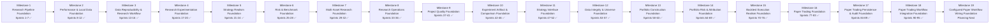

# El-Psy-Quant Roadmap

## Purpose

This roadmap turns the sprint-by-sprint project plan into a clear milestone timeline.

It is a rolling plan, not a contract. The order can change if the project learns something important, but the guiding principle stays the same:

```text
Build a reproducible research platform before chasing strategy complexity.
```

For the longer-term founder-level CTO platform plan beyond the current milestone, see:

```text
docs/strategy/future-platform-roadmap.md
```

## Timeline Overview


```mermaid
flowchart LR
    M1["Milestone 1<br/>Research Pipeline Foundation<br/>Sprints 1-7 ✅"] --> M2["Milestone 2<br/>Performance & Local Data Foundation<br/>Sprints 8-12 ✅"]
    M2 --> M3["Milestone 3<br/>Data Reproducibility & Research Workflow<br/>Sprints 13-16 ✅"]
    M3 --> M4["Milestone 4<br/>Research Experimentation Foundation<br/>Sprints 17-20 ✅"]
    M4 --> M5["Milestone 5<br/>Strategy Realism Foundation<br/>Sprints 21-24 ✅"]
    M5 --> M6["Milestone 6<br/>Risk & Benchmark Foundation<br/>Sprints 25-28 ✅"]
    M6 --> M7["Milestone 7<br/>Multi-Asset Research Foundation<br/>Sprints 29-32 ✅"]
    M7 --> M8["Milestone 8<br/>Research Operations Foundation<br/>Sprints 33-36 ✅"]
    M8 --> M9["Milestone 9<br/>Project Quality Foundation<br/>Sprints 37-41 ✅"]
    M9 --> M10["Milestone 10<br/>Experiment Artifact & Comparison Foundation<br/>Sprints 42-46 ✅"]
    M10 --> M11["Milestone 11<br/>Strategy Interface Foundation<br/>Sprints 47-52 ✅"]
    M11 --> M12["Milestone 12<br/>Data Integrity & Universe Foundation<br/>Sprints 53-57 ✅"]
    M12 --> M13["Milestone 13<br/>Portfolio Construction Foundation<br/>Sprints 58-63 ✅"]
    M13 --> M14["Milestone 14<br/>Portfolio Risk & Attribution Foundation<br/>Sprints 64-69 ✅"]
    M14 --> M15["Milestone 15<br/>Backtest Execution Realism Foundation<br/>Sprints 70-76 ✅"]
    M15 --> M16["Milestone 16<br/>Paper Trading Foundation<br/>Sprints 77-83 ✅"]
    M16 --> M17["Milestone 17<br/>Paper Trading Persistence & Audit Foundation<br/>Sprints 84-89 ✅"]
    M17 --> M18["Milestone 18<br/>Paper Trading Workflow Integration Foundation<br/>Sprints 90-95 ✅"]
    M18 --> M19["Milestone 19<br/>Configured Paper Workflow Wiring Foundation<br/>Planning Next"]
```

## Milestone Table

| Milestone | Sprint Range | Status | Theme | Exit Criteria |
|---|---:|---|---|---|
| Milestone 1 — Research Pipeline Foundation | Sprints 1-7 | Complete | Build the first minimal moving-average crossover research pipeline. | Close prices can produce signals, positions, returns, and an equity curve. |
| Milestone 2 — Performance & Local Data Foundation | Sprints 8-12 | Complete | Add evaluation metrics and deterministic local CSV input. | The project can summarize backtests and run research from local CSV data. |
| Milestone 3 — Data Reproducibility & Research Workflow | Sprints 13-16 | Complete | Add local cache, Yahoo-to-cache workflow, and CSV-to-pipeline helper. | Local market data workflows can be persisted and reused. |
| Milestone 4 — Research Experimentation Foundation | Sprints 17-20 | Complete | Make experiments repeatable and comparable. | Parameter runs can be executed and summarized without claiming false alpha. |
| Milestone 5 — Strategy Realism Foundation | Sprints 21-24 | Complete | Add realistic frictions and trade-level visibility. | Backtests include basic costs, slippage, and trade records. |
| Milestone 6 — Risk & Benchmark Foundation | Sprints 25-28 | Complete | Improve evaluation discipline. | Results can be compared against benchmarks and basic risk-adjusted metrics. |
| Milestone 7 — Multi-Asset Research Foundation | Sprints 29-32 | Complete | Move from single-symbol to multi-symbol research. | The platform can load, run, and summarize independent multi-symbol research workflows. |
| Milestone 8 — Research Operations Foundation | Sprints 33-36 | Complete | Make repeated research workflows easier to run and inspect. | Experiments can be configured, executed, and stored more consistently. |
| Milestone 9 — Project Quality Foundation | Sprints 37-41 | Complete | Add automated quality gates and repository hygiene. | Pull requests can be checked consistently. |
| Milestone 10 — Experiment Artifact & Comparison Foundation | Sprints 42-46 | Complete | Make experiment outputs easier to inspect, persist, and compare. | Runs can produce and compare stable artifacts. |
| Milestone 11 — Strategy Interface Foundation | Sprints 47-52 | Complete | Define cleaner strategy boundaries before adding more strategies. | Strategies plug into configured workflows through a stable interface. |
| Milestone 12 — Data Integrity & Universe Foundation | Sprints 53-57 | Complete | Improve data validation, symbol universe discipline, and input assumptions. | Configured runs validate symbol and price inputs before strategy execution. |
| Milestone 13 — Portfolio Construction Foundation | Sprints 58-63 | Complete | Define portfolio-level construction before attribution and execution realism. | Portfolio inputs, equal-weight returns, configurable static weights, and summary artifacts are introduced under explicit assumptions. |
| Milestone 14 — Portfolio Risk & Attribution Foundation | Sprints 64-69 | Complete | Explain portfolio-level behavior after construction is explicit. | Portfolio risk, drawdown, contribution, and attribution summary artifacts are available under conservative assumptions. |
| Milestone 15 — Backtest Execution Realism Foundation | Sprints 70-76 | Complete | Make backtest execution assumptions explicit, deterministic, and reviewable. | Execution assumptions, order intent, fill behavior, execution summaries, and execution realism artifacts are available under local research assumptions. |
| Milestone 16 — Paper Trading Foundation | Sprints 77-83 | Complete | Define local paper-trading state and records before external execution. | Paper account state, paper orders, fill application, session summaries, and artifacts are available under conservative local assumptions. |
| Milestone 17 — Paper Trading Persistence & Audit Foundation | Sprints 84-89 | Complete | Make local paper-trading outputs durable and audit-friendly before runtime workflows. | Paper-trading artifacts can be saved, loaded, validated, and summarized locally without broad operational behavior. |
| Milestone 18 — Paper Trading Workflow Integration Foundation | Sprints 90-95 | Complete | Turn local paper-trading building blocks into an explicit workflow boundary. | A paper run request can produce, persist, and summarize a local paper trading artifact without broader configured workflow behavior. |
| Milestone 19 — Configured Paper Workflow Wiring Foundation | Sprints 96+ | Planned | Plan and then wire the completed local paper workflow into configured runs conservatively. | To be defined during Sprint 96 planning. |

## Completed Milestone 16 — Paper Trading Foundation

Milestone 16 closed this conservative chain:

```text
paper account state -> paper order ledger -> paper fill application -> paper trading session summary -> paper trading artifact
```

See:

```text
docs/milestones/milestone-016-paper-trading-foundation.md
docs/sprints/sprint-083-milestone-16-closeout.md
```

## Completed Milestone 17 — Paper Trading Persistence & Audit Foundation

| Sprint | Status | Goal | Main Deliverable | Guardrail |
|---:|---|---|---|---|
| S84 | Complete | Plan Milestone 17. | Paper trading persistence and audit scope and sprint sequence. | No implementation during planning. |
| S85 | Complete | Define paper artifact file contract. | Deterministic local file contract for saved paper trading artifacts. | No writer side effects yet. |
| S86 | Complete | Add local paper artifact writer. | Save a paper trading artifact to an explicit local path. | No CLI or configured-run integration. |
| S87 | Complete | Add paper artifact reader and validation. | Load saved paper artifacts and validate schema/version expectations. | No database or artifact service. |
| S88 | Complete | Add paper session audit summary. | Compact deterministic audit summary from saved paper artifacts. | No dashboard or report generation. |
| S89 | Complete | Close milestone. | Milestone 17 documentation refresh. | No scope expansion. |

Milestone 17 closed this conservative chain:

```text
paper artifact file contract -> local paper artifact writer -> local paper artifact reader and validation -> paper session audit summary
```

See:

```text
docs/milestones/milestone-017-paper-trading-persistence-audit-foundation.md
docs/sprints/sprint-084-milestone-17-planning.md
docs/sprints/sprint-089-milestone-17-closeout.md
```

## Completed Milestone 18 — Paper Trading Workflow Integration Foundation

| Sprint | Status | Goal | Main Deliverable | Guardrail |
|---:|---|---|---|---|
| S90 | Complete | Plan Milestone 18. | Workflow integration scope, sequence, and long-term platform context. | No implementation during planning. |
| S91 | Complete | Define paper run request contract. | Small immutable request boundary for one local paper run. | No execution or file writing yet. |
| S92 | Complete | Add paper run execution boundary. | Build a paper trading artifact from an explicit request. | No CLI, broker, or configured-run integration. |
| S93 | Complete | Add paper run artifact persistence. | Persist a paper run artifact to an explicit local path using the M17 writer. | No default output-root workflow. |
| S94 | Complete | Add paper run result summary. | Compact summary tying request, artifact identity, saved path, and audit facts. | No dashboard or report generation. |
| S95 | Complete | Close milestone. | Milestone 18 documentation refresh. | No scope expansion. |

Milestone 18 closed this conservative chain:

```text
paper run request contract -> paper run execution boundary -> paper run artifact persistence -> paper run result summary
```

See:

```text
docs/milestones/milestone-018-paper-trading-workflow-integration-foundation.md
docs/sprints/sprint-090-milestone-18-planning.md
docs/sprints/sprint-095-milestone-18-closeout.md
docs/strategy/future-platform-roadmap.md
```

## Future Platform Direction

The recommended sequence now is:

```text
Sprint 96 — Milestone 19 Planning
```

The guiding idea is to move from isolated paper-trading workflow boundaries to configured workflow wiring only after the next milestone is planned explicitly.

Longer-term, the platform should move through:

```text
Phase 1 — Research & Artifact Foundation
Phase 2 — Workflow Integration Foundation
Phase 3 — Decision Intelligence Foundation
Phase 4 — Broker Readiness & Execution Governance
Phase 5 — Controlled Live Pilot & Production Operations
```

## Roadmap Principles

1. Local reproducibility beats live convenience.
2. Evaluation discipline comes before strategy complexity.
3. Parameter search is not alpha discovery.
4. Costs, slippage, and benchmarks should arrive before serious strategy claims.
5. Multi-asset research should come after single-asset workflow is stable.
6. CLI and operations should wrap stable functions, not drive architecture.
7. Automated quality gates should verify claims before humans review deeper logic.
8. Every milestone should leave the repository easier to understand than before.
9. Experiments that cannot be inspected later are not research assets.
10. Strategy interfaces should come before strategy proliferation.
11. Data validation should protect the strategy boundary before more strategies are added.
12. Portfolio construction should define capital, alignment, and allocation assumptions before portfolio risk attribution.
13. Portfolio risk should be explainable before execution realism.
14. Execution assumptions should be explicit before paper trading.
15. Paper trading state should be explicit before broker integration.
16. Paper trading artifacts should be durable and audit-friendly before runtime workflows or broker integration.
17. Paper trading workflows should be explicit before configured-run integration or broker readiness.
18. Decision records should exist before live-readiness claims.

## Current Next Step

The next sprint is:

```text
Sprint 96 — Milestone 19 Planning
```

Reason:

Sprint 96 should define the next milestone before configured paper workflow wiring is implemented.
